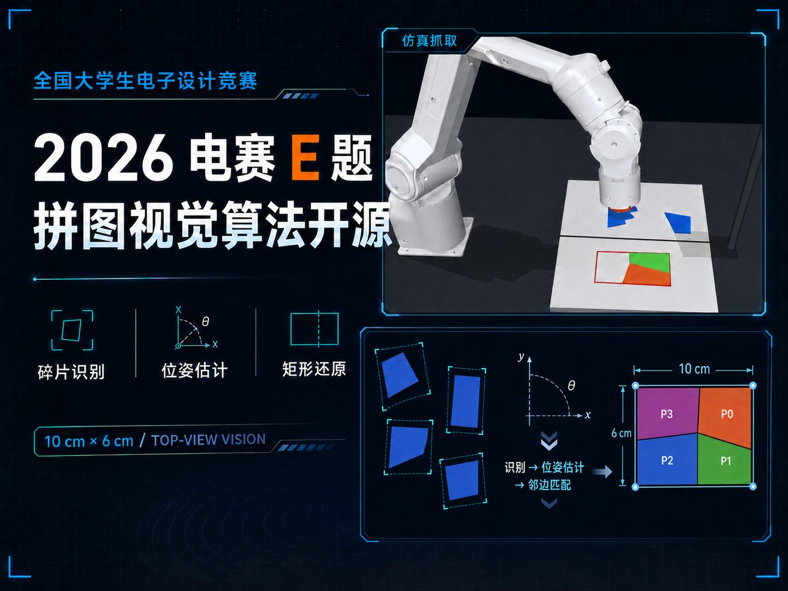

# Puzzle Vision Simulator

面向拼图装置的视觉识别、拼接规划、运动执行与 MuJoCo 仿真工程。
项目把“相机看到的拼图”转换为可验证的拼接方案，并支持在没有实体设备时使用仿真环境进行算法开发和回归测试。



## 项目特点

- **视觉处理**：工作区定位、背景差分、拼图分割、轮廓提取、边缘/角点分析。
- **拼接规划**：根据碎片几何关系生成候选拼接方案，并输出可执行的放置顺序。
- **运动执行接口**：将规划结果转换为龙门/机械臂控制所需的动作序列，并通过串口协议与设备通信。
- **标定工具**：支持相机像素坐标到工作区/执行机构坐标的转换。
- **MuJoCo 仿真**：提供包含相机、PIPER-L 机械臂、磁吸末端和拼图场景的闭环仿真。
- **可测试**：核心视觉、规划、协议和仿真逻辑均提供 Python 测试用例。

## 快速开始

### 1. 获取代码并安装依赖

```bash
git clone https://github.com/JiaXinTang-xiang/26-E.git
cd 26-E/puzzle-vision-simulator

python3 -m venv .venv
source .venv/bin/activate          # Windows: .venv\\Scripts\\Activate.ps1
python -m pip install -r requirements.txt
```

MuJoCo 仿真还需要额外依赖：

```bash
python -m pip install -r mujoco_sim/requirements.txt
```

### 2. 运行 MuJoCo 仿真

```bash
python -m mujoco_sim.run_sim --pieces 4 --seed 7
```

启动带图形界面的完整仿真：

```bash
./mujoco_sim/run_ui.sh
```

无窗口运行（适合 CI 或远程服务器）：

```bash
MUJOCO_GL=egl python -m mujoco_sim.run_sim --pieces 3 --seed 7 --headless
```

仿真结果默认写入 `output/`，该目录已被 `.gitignore` 忽略。

### 3. 运行测试

```bash
python -m unittest discover -s tests -p 'test_*.py'
```

## 连接实体设备

实体设备需要独立准备相机、串口转换器和执行机构。公开仓库只包含上位机接口、协议和算法代码，不包含下位机/STM32 工程、比赛题目或本机标定数据。

先完成本机配置，再运行控制界面：

```bash
python -m apps.competition_gui --camera 0 --serial /dev/ttyUSB0
```

Windows 示例：

```powershell
python -m apps.competition_gui --camera 1 --serial COM30
```

串口号和相机编号必须根据当前机器调整，不能假设始终是 `COM30` 或 `camera 1`。首次使用请先阅读 [上位机使用教程](puzzle-vision-simulator/使用教程.md) 和 [标定流程](puzzle-vision-simulator/docs/calibration-workflow.md)。

> 安全提示：执行真实运动前，请确认工作区无人、无障碍物，吸头和拼图位置正确，并先使用单块/低速动作验证坐标和方向。

## 目录结构

```text
puzzle-vision-simulator/
├── apps/                 # GUI 和命令行入口
├── puzzle_device/
│   ├── vision/           # 相机、分割、轮廓和稳定性分析
│   ├── planning/         # 拼接、搬运和动作规划
│   ├── calibration/      # 标定与坐标变换
│   ├── simulation/       # 轻量级拼图仿真
│   └── competition.py    # 比赛流程编排
├── mujoco_sim/           # MuJoCo 场景、机械臂和闭环仿真
├── configs/              # 可公开的默认参数
├── tests/                # 单元测试和回归测试
├── tools/                # 串口、Jetson 和案例回放工具
└── docs/                 # 架构、实验记录和媒体素材
```

## 配置与数据

机器相关的标定、串口、相机和背景图放在以下目录，并不会提交到公开仓库：

```text
configs/local/
data/local/
```

请以 [configs/README.md](puzzle-vision-simulator/configs/README.md) 和 [data/README.md](puzzle-vision-simulator/data/README.md) 中的默认配置说明为准。不要把包含个人路径、设备编号、真实采集图或密钥的文件提交到 GitHub。

## 设计文档

- [系统架构](puzzle-vision-simulator/docs/architecture.md)
- [标定流程](puzzle-vision-simulator/docs/calibration-workflow.md)
- [MuJoCo 仿真说明](puzzle-vision-simulator/mujoco_sim/README.md)
- [贡献指南](puzzle-vision-simulator/CONTRIBUTING.md)

## 开源范围与许可证

本仓库公开的是拼图视觉与仿真相关的软件部分。参考代码、下位机固件、比赛题目、个人实验数据和本机配置不在公开范围内。

代码采用 [MIT License](LICENSE)。仿真中的第三方模型、图片和其他资源以各自目录中的许可证说明为准。
